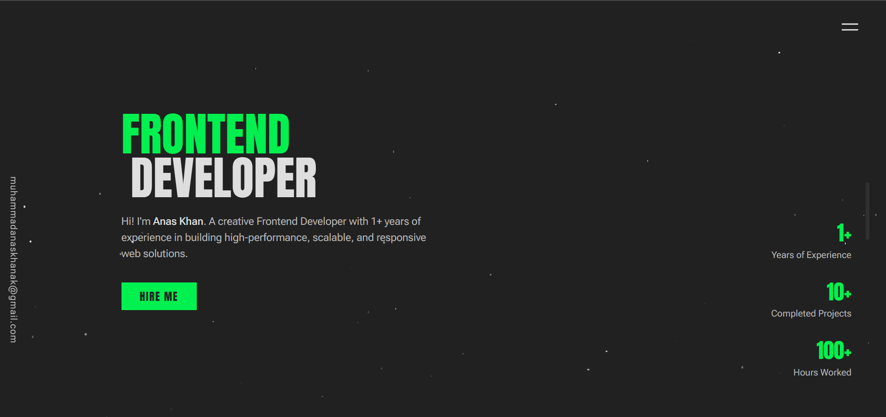

# 💼 AK Portfolio – Front-End Developer Portfolio

A modern and responsive portfolio website developed using **React.js**, **Tailwind CSS**, and **Vite**. This site serves as a personal portfolio to showcase projects, skills, and experience as a Front-End Web Developer.

---

## 🌐 Live Demo

🔗 [Visit Portfolio](https://akanaskhan.vercel.app) <!-- Replace with actual deployed link if different -->

---

## 📌 Features

-   📱 Fully responsive design for mobile, tablet, and desktop
-   🖼️ Projects section with interactive UI and hover effects
-   📄 Resume download and portfolio overview
-   📬 Contact form with email integration
-   🌘 Light/Dark mode support
-   ⚡ Fast performance and optimized build

---

## 🛠️ Tech Stack

| Technology   | Description                        |
| ------------ | ---------------------------------- |
| React.js     | Front-end JavaScript library       |
| Tailwind CSS | Utility-first CSS framework        |
| Vite         | Lightning-fast dev/build tool      |
| EmailJS      | Email integration for contact form |
| Lucide-react | Icon library                       |
| Vercel       | Deployment and hosting platform    |

---

## 🚀 Getting Started

Follow these steps to run the project locally:

### Prerequisites

-   Node.js ≥ 14.x
-   npm or yarn

### Installation

```bash
# Clone the repository
git clone https://github.com/akanaskhan/portfolio.git

# Navigate to the project directory
cd portfolio/portfolio

# Install dependencies
npm install

# Start development server
npm run dev
```

Then visit: `http://localhost:5173`

---

## 📁 Project Structure

```
portfolio/
├── assets/             # Images and media
├── components/         # Reusable React components
├── pages/              # Pages of the website
├── App.jsx             # Main application file
├── main.jsx            # Entry point
└── index.html          # HTML template
```

---

## 📸 Preview

> 
> 

---

## 📬 Contact

Feel free to connect or reach out for collaborations or freelance work:

-   📧 Email: yourname@example.com
-   🌐 Website: [akanaskhan.vercel.app](https://akanaskhan.vercel.app)
-   💼 LinkedIn: [linkedin.com/in/akanaskhan](https://www.linkedin.com/in/akanaskhan)

---

## 📝 License

This project is licensed under the MIT License.  
See the [LICENSE](../LICENSE) file for more details.

---

> Designed and developed with ❤️ by Anas Khan
